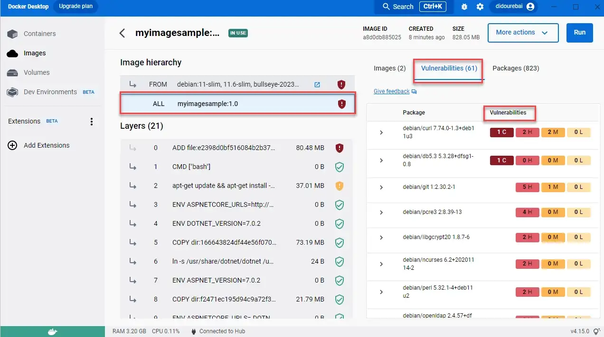

# Best practices to prepare .NET Docker images
In this blog, we will create a new Web API application using Visual Studio Code, we will containerize this application, then we will optimize the container image. We will check and fixe vulnerabilities.

1- Create a new application using .NET CLI

Let’s start by creating a new application using .NET CLI.
```bash
dotnet new webapi
```
We will containerize our application.

2- Add Dockefile:

Each Dockerfile is a script with a set of various commands (instructions) and arguments that automatically perform actions on the base image to build (or form) a new image. They are used to keep things organized and are very helpful in deployment by simplifying the process from start to finish.
Dockerfiles start by defining the image from which the build process starts. In return, various other methods, commands, and arguments (or conditions) follow, providing a new image that is used to build the Docker container.

After creating a new file: Dockerfile, Docker images can be inherited from other images. Therefore, instead of creating our own image, we’ll use the official .NET SDK image that already has all the tools and packages that we need to build a .NET application. We will use the base image in the FROM statement: mcr.microsoft.com/dotnet/sdk:latest, we will run on Port 5000 so we will use EXPOSE statement. Then we will let dotnet or ASPNETCORE know that we want to listen on the port mentioned before, we don’t need to add an IP address:
```bash
FROM mcr.microsoft.com/dotnet/sdk:latest
EXPOSE 5000
ENV ASPNETCORE_URLS=http://+:5000
```
To simplify running the rest of our commands, we used Workdir /src to create a working directory for our source files. This instructs Docker to use this path as the default location for all subsequent commands. By doing this, we do not have to type out full file paths but can use relative paths based on the working directory. We use RUN dotnet restore to load all dependencies. Each command creates a new container layer. To speed the building of containers, Docker caches these layers. Since these files won’t change often, we can take advantage of the caching by copying these files and running restore as separate commands. Then we will publish our project in a release mode and we want to put in into a folder. (/publish)
```bash
WORKDIR /src
COPY . .

RUN dotnet restore “DockerSample.csproj”
RUN dotnet publish “DockerSample.csproj” -c Release -o /app/publish
```
We will change into that particular folder that we where just published the application then we run the dotnet and the dll using ENTRYPOINT.

ENTRYPOINT command is used to start-up the app, it takes an array that transforms into a command-line invocation with arguments. We will invoke dotnet and application dll.
```bash
WORKDIR /app/publish
ENTRYPOINT [“dotnet”, “DockerSample.dll”]
```
This is a basic file, we can generate a Dockerfile using the Command Palette (Ctrl+Shift+P) and using Docker: Add Docker Files to Workspace command. The command will generate Dockerfile and .dockerignore files and add them to your workspace.

Let’s build and run our image using this command, we use -t to give our image a name myimagesample becomes the image name. Our last argument is a punctuation . and means where we can find the Dockerfile, which in our case is the current directory.:
```bash
docker build -t myimagesample:1.0 .
```
We will have a warning message that recommend to use Docker san to check image vulnerabilities.
We will use docker run to execute our image myimagesample:1.0 in interactive mode (-ti).
```bash
docker run -p 5000:5000 — name mydockerimage -ti — — rm myimagesample:1.0
```
Let’s take a look at the image size in Docker Desktop:


We will use docker scan as recommended in the build task to check the vulnerabilities.
```bash
docker scan myimagesample:1.0
```
We can see that we have some vulnerabilities to resolve.


We will use a multi-stage build and define a stage for building the application. Docker can use one base image for compilation, packaging, and unit tests. This feature allows you to define stages based on different base images. This means you can use a base image that contains all the dependencies you need to build or publish your application and then a minimal base image containing just runtime dependencies. We define a build stage in our Dockerfile using AS

To optimize Dockerfiles while still being readable and maintainable we will use Multi-stage builds.

To optimize the multistage builds by using right image as the base image to reduce image sizes. If we minimize the image size, we minimize the surface attack, we will use alpine for example instead of the default OS (Debian). We need to use specific base image tag instead of latest, we will use .NET 7 framework in our case.

And the Dockerfile will be similar to this content:
```bash
FROM mcr.microsoft.com/dotnet/aspnet:7.0-alpine AS base

WORKDIR /app

EXPOSE 5000

ENV ASPNETCORE_URLS=http://+:5000

FROM mcr.microsoft.com/dotnet/sdk:7.0-alpine AS build

WORKDIR /src

COPY [“DockerSample.csproj”, “./”]

RUN dotnet restore “DockerSample.csproj”

COPY . .

WORKDIR “/src/.”

RUN dotnet build “DockerSample.csproj” -c Release -o /app/build

FROM build AS publish

RUN dotnet publish “DockerSample.csproj” -c Release -o /app/publish

WORKDIR /app/publish

ENTRYPOINT [“dotnet”, “DockerSample.dll”]
```
We use this command line to build the image, we use another tag 2.0 to see the size difference between the first image and the second one:
```bash
docker build -t myimagesample:2.0 .
```
To reduce latency by compiling assemblies, we will use Ready to Run. You can do this by setting the PublishReadyToRun property, which takes effect when you publish an application.

We will update this line in Dockerfile:
```bash
RUN dotnet restore “DockerSample.csproj” -r alpine-x64 /p:PublishReadyToRun=true
```
Our that comes doesn’t use R2R compilation since the application is too small to warrant it. The bulk of the IL code that’s executed in our application is within .NET’s libraries, which are already R2R-compiled (runtime/readytorun-overview.md at main · dotnet/runtime · GitHub).

To enables R2R in ourDockerfile, we will pass /p:PublishReadyToRun=true to the dotnet build and dotnet publish commands.

To optimize the publish, we will use also : — no-restore /p:PublishTrimmed=true /p:PublishSingleFile=true
Creates a non-root user with an explicit UID and adds permission to access the /app folder
We will add this bloc in Dockerfile after ENV ASPNETCORE_URLS=http://+:5000:
```bash
RUN adduser -u 5678 — disabled-password — gecos “” appuser && chown -R appuser /app
```
raries, and plugins. You’ll determine which of these components to include while constructing a new image.
With the .dockerignore file, we can determine which components are vital. They’ll ultimately belong to the new image that we’re building.
For example, if we don’t want to include the bin and conf directory in our image build, we just need to indicate that within our .dockerignore file.
Add Health Checks to Your Containers
The HEALTHCHECK instruction used in Docker to test the container and make sure it’s still working. This allows you to detect when (for example) your web server is stuck in an infinite loop and cannot handle new connections (even if the server process is still running).

Once the application is deployed in production, it will likely be managed by an orchestrator such as Kubernetes or Service Fabric. It provides health checks to share container status with Orchestrator to allow configuration-based management tasks. Consider the following modification in Dockerfile:
```bash
#If you’re using the Linux Container
```bash
HEALTHCHECK CMD curl — fail http://localhost || exit 1
```
#If you’re using Windows Container with Powershell
#HEALTHCHECK CMD powershell -command `
try { `
$response = iwr http://localhost; `
if ($response.StatusCode -eq 200) { return 0} `
else {return 1}; `
} catch { return 1 }
```
And we add these instrcution in Dockerfile before RUN adduser:
```bash
HEALTHCHECK CMD curl — fail http://localhost:5000/DockerSample || exit 1
```
When HEALTHCHECK is present in a Dockerfile, you’ll see the container’s health in the STATUS column while running docker ps. A container that passes this check displays as healthy. An unhealthy container displays as unhealthy.

We made some changes in Dockerfile to use mcr.microsoft.com/dotnet/runtime-deps instead of using mcr.microsoft.com/dotnet/aspnet ans we will reorder our file.
See Dockerfile.
Conclusion
The best practices for Containerizing Your .NET Application are :

Select the right .NET Docker images and use specefic Base image tags not latest:
Select from these Repos:

dotnet/sdk: .NET SDK
dotnet/aspnet: ASP.NET Core Runtime
dotnet/runtime: .NET Runtime
dotnet/runtime-deps: .NET Runtime Dependencies
dotnet/monitor: .NET Monitor Tool
dotnet/samples: .NET Samples
In our sample, we used .NET SDK and .NET Runtime Dependencies, we used 7.0-alpine version, that is the latest version in Alpine environment.

Optimize your Dockerfile for dotnet Restore
The dotnet restore command uses NuGet in order to restore dependencies and the different tools that are specified in the project file.

Use a Multi-Stage Build
With multi-stage builds, Docker can use one base image for compilation, packaging, and unit tests.

For more information about multi-stage build, use this link: Multi-stage builds | Docker Documentation

Run as a Non-root user to secure more your image
By default, while your application is running in a Docker container, your application has access to the root directory on Linux or administrator privileges on Windows. This can compromise application security. This issue can be resolved by including the USER directive in your Dockerfile. The USER directive specifies a preferred user name (or UID) and optionally a user group (or GID) during execution of the image and for any subsequent RUN, CMD, or ENTRYPOINT statements for her.

Use .dockerignore
To improve build performance (and as a general best practice), we recommend creating a .dockerignore file in the same directory as your Dockerfile.

Add Health Checks to Your Containers
We add HEALTHCHECK instruction to test a container and confirm that it’s still working.

For example, this allows to detect that the web server is stuck in an infinite loop and cannot handle new connections even though the server process is still running.

Optimize for Startup Performance
Compiling assemblies using ready-to-run (R2R) compilation can improve startup time and reduce latency for .NET apps. However, as a trade-off, this increases build time. To do this, set the PublishReadyToRun property, which takes effect when you publish your application.

The default Dockerfile generated using Visual Studio Code or Visual Studio 2022 does not use R2R compilation because the application is too small to use R2R compilation. Most of the IL code that runs application is in the R2R compiled .NET library. For more performance, we enable R2R in the Dockerfile and pass /p:PublishReadyToRun=true to the dotnet build and dotnet publish commands.

Select the best Isolation Mode For Windows Containers
If you will use Windows as environment to build containers, we have two modes of runtime isolation:

Process Isolation: we will rum multiple container instances concurrently in the same host with isolation with registry, file system, network port, thread ID space, process and Object Manager namespace. This is almost identical to running Linux containers.
Hyper-V Isolation: Containers run in highly optimized virtual machines that provide hardware-level isolation between containers and the host.
When we develop locally, most of developers prefer process isolation, because it consumes fewer hardware resources than Hyper-V mode.

But sometimes for security issue, we can decide to choose Hyper-V isolation. To specify the isolation level, you need to add --isolation flag n running docker container command as mentioned bellow:
```bash
docker run -it — isolation=process mcr.microsoft.com/windows/servercore:ltsc2019 cmd
```
